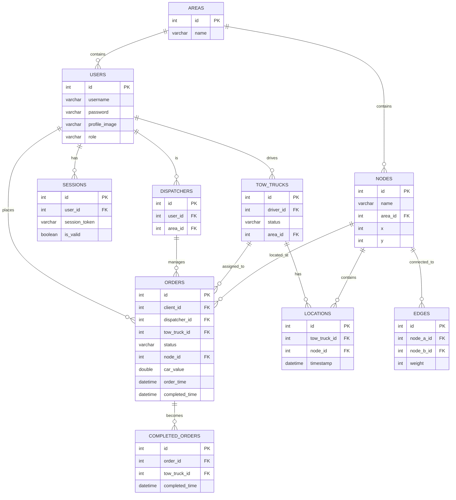

```mermaid
erDiagram
    AREAS ||--o{ USERS : contains
    AREAS ||--o{ NODES : contains
    USERS ||--o{ SESSIONS : has
    USERS ||--o{ DISPATCHERS : is
    USERS ||--o{ TOW_TRUCKS : drives
    USERS ||--o{ ORDERS : places
    DISPATCHERS ||--o{ ORDERS : manages
    TOW_TRUCKS ||--o{ LOCATIONS : has
    TOW_TRUCKS ||--o{ ORDERS : assigned_to
    NODES ||--o{ LOCATIONS : contains
    NODES ||--o{ ORDERS : located_at
    NODES ||--o{ EDGES : connected_to
    ORDERS ||--o{ COMPLETED_ORDERS : becomes

    AREAS {
        int id PK
        varchar name
    }
    USERS {
        int id PK
        varchar username
        varchar password
        varchar profile_image
        varchar role
    }
    SESSIONS {
        int id PK
        int user_id FK
        varchar session_token
        boolean is_valid
    }
    DISPATCHERS {
        int id PK
        int user_id FK
        int area_id FK
    }
    TOW_TRUCKS {
        int id PK
        int driver_id FK
        varchar status
        int area_id FK
    }
    NODES {
        int id PK
        varchar name
        int area_id FK
        int x
        int y
    }
    EDGES {
        int id PK
        int node_a_id FK
        int node_b_id FK
        int weight
    }
    LOCATIONS {
        int id PK
        int tow_truck_id FK
        int node_id FK
        datetime timestamp
    }
    ORDERS {
        int id PK
        int client_id FK
        int dispatcher_id FK
        int tow_truck_id FK
        varchar status
        int node_id FK
        double car_value
        datetime order_time
        datetime completed_time
    }
    COMPLETED_ORDERS {
        int id PK
        int order_id FK
        int tow_truck_id FK
        datetime completed_time
    }
```
